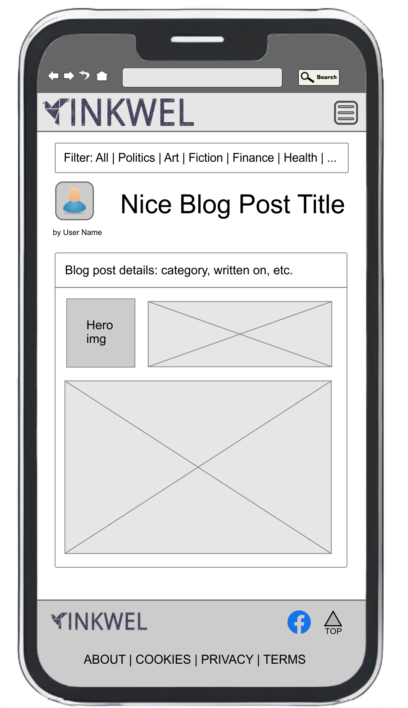

# Portfolio-project-5
Portfolio Project 5 - E-commerce Applications

# 📝 InkWell – A Premium Blogging Platform

**InkWell** is a full-stack blogging platform that allows authors to publish both public and subscriber-only posts. It includes e-commerce integration for subscriptions, secure role-based authentication, SEO features, and a clean, accessible UI.

## 📌 Table of Contents
- [Project Overview](#project-overview)
- [User Types & User Stories](#user-types--user-stories)
- [Features](#features)
- [Technologies Used](#technologies-used)
- [Agile Workflow](#agile-workflow)
- [Wireframes & UX Design](#wireframes--ux-design)
- [Setup Instructions](#setup-instructions)
- [Testing](#testing)
- [Deployment](#deployment)
- [License](#license)

## How to View the Project
- [View the deployed website](https://github.com/AlexeyKopchinskiy/Portfolio-project-5/)

## 📖 Project Overview

This platform allows authors to manage and monetize content while providing a premium experience for paid subscribers. The goal is to provide a clean, SEO-optimized, and secure blogging space with real e-commerce functionality.

## 👥 User Types & User Stories

### Site Owner
- Manage posts, categories, and publishing schedule
- Track subscribers and view platform analytics
- Receive notifications of new subscriptions and comments

### Visitor / Reader
- Browse and read public blog posts without registration
- Register, log in, and subscribe for premium content
- Like, bookmark, and comment on posts

Check out the full list of [user stories and issues here](#) ← *(you can link to your Issues tab or GitHub project board)*

## ✨ Features

- Stripe-powered subscriptions
- Public and premium post access
- Role-based authentication
- Responsive, accessible UI with dark/light mode
- Bookmarking, commenting, and category filters
- Facebook product page / promotional mockup
- Newsletter signup and SEO features (meta tags, sitemap)

## 🛠 Technologies & Software Used

| Purpose            | Tool(s)                       |
|--------------------|-------------------------------|
| Code Development   | Visual Studio Code            |
| Backend Framework  | Django (Python)               |
| Database           | PostgreSQL                    |
| DB modelling       | Dbdiagram.io                  |
| UI Styling         | HTML, CSS, Bootstrap          |
| Design/Mockups     | CorelDraw, Photoshop          |
| Wireframing        | CorelDraw, Photoshop          |
| Deployment         | Heroku (or similar)           |
| Payments           | Stripe API                    |
| Version Control    | Git & GitHub                  |

## 🚀 Agile Workflow

- Agile board managed with GitHub Issues and Milestones  
- User stories split into:
  - Developer stories
  - Site owner stories
  - Visitor stories
- Labels include `Must-Have`, `Should-Have`, and `Could-Have`
- Milestones:
  - Project Setup
  - Auth & Roles
  - E-Commerce
  - Blog Engine
  - UX/UI
  - SEO & Marketing
  - Testing & Deployment

## 📐 Wireframes & UX Design

- Homepage  
- Post detail & premium prompt  
- Admin dashboard  
- User profile | saved posts  

### Website low-fidelity wireframes

#### 🏠 Homepage (Public View)


#### Mobile Homepage


#### Mobile Blog Post Details



### Mobile Login/register page


### Mobile Member Page


## 🔧 Django Apps

| **App name**    | **Purpose**                                  |
|-----------------|----------------------------------------------|
| blog            | Posts, categories, tags, post detail views   |
| accounts        | Custom user model, login, registration       |
| subscriptions   | Stripe integration, premium access control   |
| core            | Homepage, about, footer, reusable templates  |
| admin_dashboard | Admin-only views for content and analytics   |

## DB Modelling

**dbdiagram.io** is used for DB modelling

### User model
```
Table users {
  id integer [primary key]
  username varchar
  role varchar
  created_at timestamp
}
```

### Posts model
```
Table posts {
  id integer [primary key]
  title varchar
  body text [note: 'Content of the post']
  user_id integer [not null]
  status varchar
  created_at timestamp
}
```

### Following users
```
Table follows {
  following_user_id integer
  followed_user_id integer
  created_at timestamp
}
```

### 🏷️ tags (many-to-many with posts)
```
Table tags {
  id integer [primary key]
  name varchar
  slug varchar
}

Table post_tags {
  post_id integer [ref: > posts.id]
  tag_id integer [ref: > tags.id]
}
```

### 💬 Comments or discussion
```
Table comments {
  id integer [primary key]
  post_id integer [ref: > posts.id]
  user_id integer [ref: > users.id]
  content text
  created_at timestamp
}
```

### 💼 Premium subscriptions (tied to Stripe IDs)
```
Table subscriptions {
  id integer [primary key]
  user_id integer [ref: > users.id]
  plan varchar
  started_on timestamp
  expires_on timestamp
  stripe_customer_id varchar
}
```

## SQL markdown


## ⚙️ Setup Instructions

```bash
git clone https://github.com/your-username/inkwell.git
cd inkwell
pip install -r requirements.txt
python manage.py migrate
python manage.py runserver
```

## ✅ Testing
- Manual testing checklist available in the /testing folder
- Unit and integration tests written using Django’s TestCase framework
- Accessibility and SEO audited with Lighthouse

## 🚢 Deployment
- Live app hosted on Heroku (or insert platform)
- Environment variables managed securely via .env files
- DEBUG = False and secret keys hidden in production

## 📄 License
🧑‍💻 Code
This project is licensed under the dual-license (MIT License + Creative Commons).

[](https://opensource.org/licenses/MIT)

## ✍️ Content
All original written content (blog posts, mock posts, text) is licensed under
Creative Commons Attribution-NonCommercial 4.0 International (CC BY-NC 4.0).

## 🙌 Acknowledgements
Special thanks to the tutors, the assessment handbook, and caffeine.